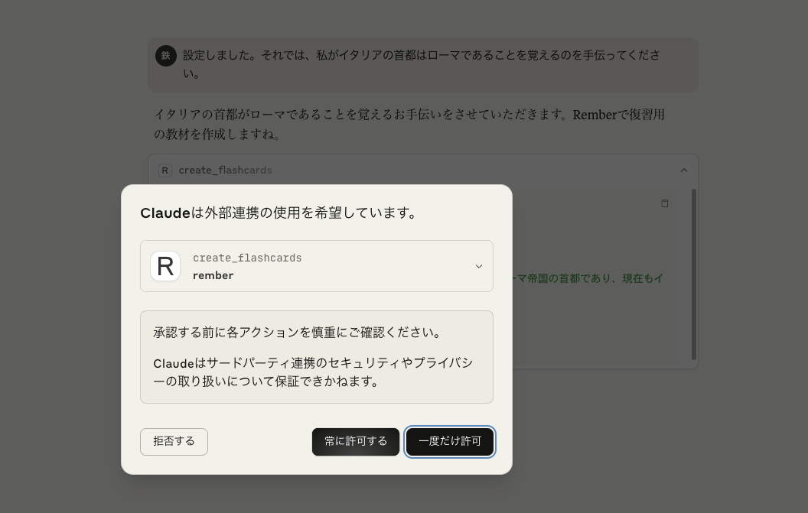
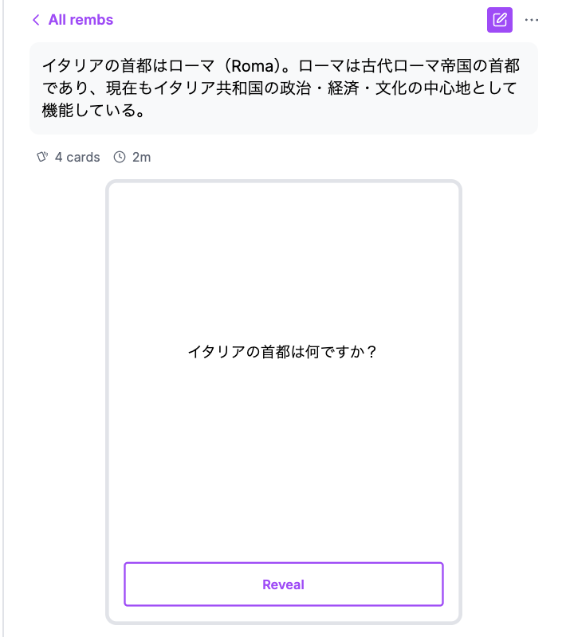

## 2025-07-11

続きから。

[effect/packages/cli at main · Effect-TS/effect](https://github.com/Effect-TS/effect/tree/main/packages/cli)

```ts
const command = Command.make("rember-mcp", { apiKey }, ({ apiKey }) =>
  pipe(
    toolkit,
    Effect.flatMap((tools) =>
      Layer.launch(layerServerMCP({
        name: "rember",
        version: "1.1.3",
        tools
      }))
    ),
    Effect.provide(layerTools),
    Effect.provide(layerRember),
    Effect.provide(
      pipe(
        ConfigProvider.fromJson(Option.isSome(apiKey) ? { REMBER_API_KEY: Redacted.value(apiKey.value) } : {}),
        ConfigProvider.orElse(() => ConfigProvider.fromEnv()),
        (_) => Layer.setConfigProvider(_)
      )
    )
  ))
```

Commandは引数にコマンド名、引数またはオプション、ハンドラの3つをとる。

レイヤーをpipeでついないでいる箇所の、型を確認してみよう。

- toolkit: `AiToolkit<typeof ToolCreateFlashcards>`
- layerServerMCP: `Layer.Layer<ServerMCP, ErrorServerMCP, R>` Rはtoolkitの依存かな？
  - Layer.launchした後の型は、`Effect.Effect<never, ErrorServerMCP, Registry | Tool.Service<"CreateFlashcards">>`
- layerTools: ` Layer<AiToolkit.Registry | AiToolkit.Tool.Service<"CreateFlashcards">, never, Rember>`
- layerRemember: `Layer.Layer<Rember, ConfigError, HttpClient.HttpClient>`
- ConfigProvider

最終的な依存はHttpClientだけになっていて、これは後から渡している。よく見たらこれレイヤーじゃなくてEffectだった。レイヤーのprovideは`Layer.provide`なので。エフェクトにレイヤーをprovideしている、ちょっとよくわからない。

Configのところは流し読み、オプションで指定していればそれを読み取って、そうでなければ環境変数から読んでいるようだ。

---

`Command.run`でcliを作成し、`layerUndici`、`layerLogger`を渡してから実行している。cliは`CliApp.Environment`が必要なので、それを`NodeContext.layer`で渡している。`NodeRuntime.runMain`の実行結果は`void`。ログについてはまた今度。

```ts
export const run = Command.run(command, {
  name: "Rember MCP server",
  version: "1.1.3"
})

// #:

run(process.argv).pipe(
  // Report errors, this needs to happen:
  // - After the creation of our main layers, to report errors in the layer construction
  // - Before providing `layerLogger` so that the errors are reported with the correct
  //   logger
  // Note that we set `disableErrorReporting: true` in `NodeRuntime.runMain`.
  Effect.tapErrorCause((cause) => {
    if (Cause.isInterruptedOnly(cause)) {
      return Effect.void
    }
    return Effect.logError(cause)
  }),
  Effect.provide(NodeHttpClient.layerUndici),
  Effect.provide(layerLogger),
  Effect.provide(NodeContext.layer),
  NodeRuntime.runMain({ disableErrorReporting: true, disablePrettyLogger: true })
)
```

エフェクトがレイヤーを必要とすることもあるんだと思ったが、エフェクト側からすればサービスでもレイヤーでも呼び出し方は同じ（`yield*`）だから関係がない。レイヤーはサービスを作成するものなので、Effectから`yield*`した時には適切に依存関係が解決されて作成されたサービスを受け取れるのだろう。

## 2025-07-10

[rember/rember-mcp: A Model Context Protocol (MCP) server for Rember.](https://github.com/rember/rember-mcp/tree/main)

Effectを使っているアプリケーションを探したら見つかった。実際に使ってみる & コードリーディングをしてみる。

**使ってみる編**

チャットからフラッシュカードを作成する機能と、PDFからフラッシュカードを作成する機能の2つが提供されている。

必要なツールは

- Claude Desktop
- Fleur（Claude DesktopにMCPサーバーを追加するためのアプリ）
  - claude_desktop_config.jsonに設定すれば使わなくてもOK

```bash
# Claude Desktopをインストール
brew install --cask claude
```

とりあえずFleurは使わずにやってみる。`claude_desktop_config.json`をClaude Desktopを操作して作成して、Rember MCPを使う設定を記述する。

---



お願いをするとダイアログが出てきた。フラッシュカードも作成されている！



---

**コードリーディング編**

`create_flashcards`という単一のツールが実装されている。READMEにMCPサーバーを実装するときのベストプラクティスが書かれているのでとりあえず見てみよう。

- デバッグのために`stderr`になるべく早くログを出そう
- 最初は単純なMCPサーバーを実装してClaudeが呼び出せることを確認しよう
- ツールの説明文は時間をかけて繰り返し改善しよう
  - 製品の詳細やURLを含める
  - Claudeがツールを呼び出した後に何が起きるかを記載する
  - ユーザーがツールをどのように呼び出すかを記載する
  - etc...

ClaudeがMCPサーバーを適切な場面で、適切な引数で呼び出せるように、descriptionをしっかりと書いておく必要があるみたい。ClaudeがMCPをModel Context Protocol以外の略語だと考えることもあったらしく、これは現在までのアップデートで改善されているのではないかと思う。

---

Claude Codeとコードリーディングをしていく。

1. プロジェクトの基本情報

- Q1: このプロジェクトの正式名称は何ですか？
  - rember-mcp
- Q2: このプロジェクトの主な目的は何を提供することですか？
  - ClaudeがRemberのフラッシュカードを作成できるような、MCPサーバーを作成すること
- Q3: パッケージマネージャーは何を使用していますか？
  - pnpm

2. 技術スタック

- Q4: このプロジェクトで使用されているメインのEffectライブラリは何ですか？
  - `@effect/platform`、`@effect/platform-node`、`@effect/ai`は使ってるけどどれがメインかはわからない...
- Q5: CLIを構築するために使用されているEffectのパッケージは何ですか？
  - `@effect/cli`
- Q6: このプロジェクトはどのプロトコルを実装していますか？
  - Model Context Protocol

3. アーキテクチャ

- Q7: メインのエントリーポイントファイルはどこにありますか？
  - `src/bin.ts`だと思うんだけど、npxで実行した時にこれが実行される設定はどこ書いているかわからなかった。
- Q8: MCPサーバーの実装は主にどのファイルで行われていますか？
  - サーバーを定義しているのは`src/serber-mcp.ts`。`src/tools.ts`にフラッシュカードのツールがあって、MCPクライアントが使うのはコレ。
- Q9: ツールの定義と実装はどのファイルで行われていますか？
  - `src/tools.ts`

4. 機能

- Q10: このプロジェクトが提供する主要なツールの名前は何ですか？
  - `AiToolKit`の実装がわからないけど、`CreateFlashCards`だと推測できる
- Q11: フラッシュカードの作成で、一度に送信できる最大ノート数は何個ですか？
  - 50個
- Q12: RemberのウェブサイトのURLは何ですか？
  - https://rember.com

5. Effect使用状況

- Q13: このプロジェクトでは、Effectのどの機能を使用してDI（依存性注入）を実現していますか？
  - Effectのレイヤーと、Effect.provide。
- Q14: エラーハンドリングにはEffectのどの機能を使用していますか？
  - これはちょっとわからないけれど、Rember APIの呼び出しのエラーはSchema.TaggedErrorを使って定義している。
- Q15: 設定管理には、Effectのどの機能を使用していますか？
  - Config。API_KEYにしか使ってなさそう。

とりあえずコードにざっと目を通してみたメモ。

- tools.ts フラッシュカードのツールを作成している。AiToolkitというのを使っているが詳細は不明。
- server-mcp.ts MCPのSDKを使って、MCPサーバーを実装している。AiToolkitのツールをMCP用のツールに変換している部分があり、微妙に噛み合ってないのかな？と気になった。
- rember.ts Rember APIのクライアントを実装している。Rember APIのデータやエラーの型を定義したり、APIエンドポイントを定義したり。それを使って型安全なAPIクライアントを作成している。
- bin.ts エントリーポイント。Node用のコマンドを定義して、MCPサーバーのレイヤーとツールのレイヤーを統合している。

---

`@effect/ai`など使うかどうかわからないものは置いておいて、順番に読んでいこう。コード量も多くないので、分からないところは一つずつ調べていく。

まずはエントリーポイントの`bin.ts`から読む。

```ts
const apiKey = pipe(
  Options.text("api-key"),
  Options.withSchema(ApiKey),
  Options.map(Redacted.make),
  Options.optional
)
```

```ts
const ApiKey = Schema.String.pipe(
  Schema.pattern(/^rember_[a-f0-9]{32}$/),
  Schema.brand("ApiKey")
)
```

[Branded Types | Effect Documentation](https://effect.website/docs/code-style/branded-types/)

`Schema.brand`について。Brand型を作るためのやつ。

Brand型の値を作るためには、Brand型のモジュールの`Brand.nominal()`または`Brand.refined()`を使う。

nominalは実行時バリデーションが不要な場合に使い、refineは必要な場合に使う。

使い方は大体こんな感じ。バリデーションに失敗した場合は例外を投げるので、回復することは想定されていない。

```ts
type UserId = number & Brand.Brand<"UserId">

const UserId = Brand.nominal<UserId>()

const getUserById = (id: UserId) => {
  return id
}

getUserById(UserId(1))

type Int = number & Brand.Brand<"Int">

const Int = Brand.refined<Int>(
  (n) => Number.isInteger(n),
  (n) => Brand.error(`Expected ${n} to be an integer`)
)

const x: Int = Int(3)
console.log(x)

const y: Int = Int(3.14)
// throws [ { message: "Expected 3.14 to be an integer" }]
console.log(y)
```

とりあえずBrandモジュールについては理解。次はSchema.Brandの使い方を見てみよう。

Schemaを使ってパースするには`validate`、`decode`、`decodeEither`、`decodeOption`などを使う。`decode`は`decodeUnknown`の省略系。`validate`と`decode`は多分同じ。

他にも、型ガードの`Schema.is`、アサーションの`Schema.asserts`などが用意されていて便利。

めっちゃ脇道に逸れているけど元のコードに戻る。次は`Options`モジュールを調べよう。

```ts
const apiKey = pipe(
  Options.text("api-key"),
  Options.withSchema(ApiKey),
  Options.map(Redacted.make),
  Options.optional
)
```

と思ったけど、これEffectのOptionじゃなくて、@effect/cliのOptionsだ。ということはコマンドラインの引数を表すやつですね。`Redacted`はセキュアな情報をログなどに表示しないようにするために使うデータ型。とりあえずあまり深掘りはしない。
